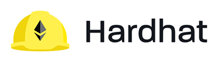
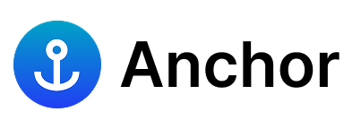
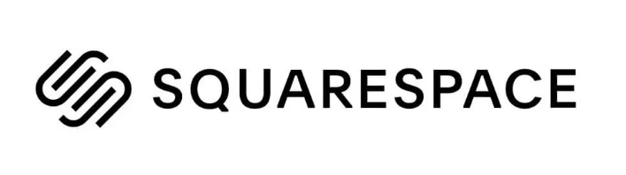
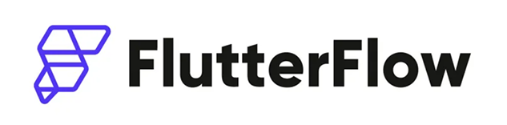
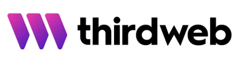

</img>

<h1 align="center">
    
<!--     <b>Yo, I'm Ang Jianming 🤙</b> -->
</h1>

<h4 align="center">
    <b>💪 Creating big impressions with fewer words. 💪</b>
</h4>

<!--
**AngJianming/AngJianming** is a ✨ _special_ ✨ repository because its `README.md` (this file) appears on your GitHub profile.

Here are some ideas to get you started:
-->

<h2 align="center">
    <b>👀 Profile Views</b> 
    
</h2>

- 🧑🏻‍💻 I'm a nub Full-stack Developer documenting my work and projects @ via [GitHub](https://github.com/AngJianming)
- 🎒 I pursued my studies as a Software Engineer specialised in AI @ Asia Pacific University Malaysia (APU)
- 🌟 Love making interactive frontend, functions, crypto wallet connections, and 3d websites in Web2 and Web3
- 🤔 Currently diving deeper into Web3, Blockchain technology, Agentic AI and Cryptography
- 💼 Currently working 1 job: Software engineer and iot product producer at Credit APU
- 💬 How to reach me: [LinkedIn](https://www.linkedin.com/in/angjianming) || [Portfolio Website](https://angjianming.vercel.app/)
<!-- 🕵️‍♂️ Always looking for Remote with KPI or Freelancing job opportunities -->

<h2>-----      🛠️  Tech Stacks That I've Used so far...  ⚙️      -----</h2>

### Languages
`English` | `Chinese` | `Cantonese` | `Malay` 

                  

---
### Frameworks & Libraries
                        

---
### IDE, Cyber, & Productivity tools 
                    

---
### Databases
      

---
### DevOps, DevSecOps, Cloud & Server hosting
         

---
### AI Engineering & Automation tools
        

---
### Operating Systems (OS)
  

<!-- Github Achievements --> 
  

  

<!-- Quotes -->

       

<h1 align="center">🔥 Stats 🔥</h1>
<!-- Github Streaks -->

    

<!---->

<!-- Github Stats -->

<!-- Most Used Languages -->

 

  

<!-- Waka Time Stats -->
<td colspan="0" align="left">
  
</td>

           

    

        

  
 
    <h3>👨🏻‍💻 Hackathon Expirences</h3>
  

 

| Position | Hackathon | Duration | Description | Link |
|----------|-----------|----------|-------------|------|
| Participant | Google Kitahack 2025 | 9th Apr 2025 | DigiWastes ~ An app for e-recycling vending machine locator & AI electronics value detector | [KitaHack-2025-GDG](https://github.com/AngJianming/KitaHack-2025-GDG) |
| Participant | Varsity Hackathon 2025 | 17th Mar 2025 | Pydantic Intraday Scalping and Algorithmic Trading AI (PISATA) ~ Varsity Hackathon 2025 | [PISATA](https://github.com/AngJianming/PISATA) |
| Participant | GodamLah Hackathon 2024 | 16th Nov 2024 | AI eKYC veriswift project | [GODAMLah-Hackathon](https://github.com/AngJianming/GODAMLah-Hackathon) |
| Participant | UMPSA x Huawei AppGalery Hackathon 2024 | 4th Nov 2024 | A Galery App that helps users do a good Habit quest | [UMPSA-x-Huawei-AppGalery-Hackathon-2024](https://github.com/AngJianming/UMPSA-x-Huawei-AppGalery-Hackathon-2024) |
| Participant | Solana Radar Global Hackathon | 8th Oct 2024 | A Decentralised News platform with anonymous voting system coded | [Radar-Hackathon-OnlyNews](https://github.com/AngJianming/Radar-Hackathon-OnlyNews) |
| Participant | Solana Radar Global Ideathon | 30th Aug 2024 | A Decentralised News platform with anonymous voting system figma design | [Radar-Hackathon-OnlyNews](https://github.com/AngJianming/Radar-Hackathon-OnlyNews) |
| Participant | APUBCC DevMatch Hackathon 2024 | 24th Aug 2024 | Share Estate a Decentralised Property platform | [APUBCC-DevMatch-Hackathon-2024-ShareEstate](https://github.com/AngJianming/APUBCC-DevMatch-Hackathon-2024-ShareEstate) |
| 3rd Place | Web 3 Entrepreneurship 101 Bootcamp Mini Hack DeFi Track | 17th Aug 2024 | Created a Sabar & Sarawak carbon credits donation platform | [LinkedIn Honors & awards](https://www.linkedin.com/in/ang-jianming-3a2a3a319/) |
| Participant | APUGDSC Google Workspace Hackathon | 15th July 2024 | Streamline for Better Evaluation of Sales and Service Communication | [APUGDSC-Google-Workspace-Hackathon](https://github.com/AngJianming/APU-GDSC-Google-Workspace-Hackathon-2024) |

  
 
    <h3>👾 F-Sec & CTF Expirences</h3>
  

 

    
| Position | F-Sec & CTF | Duration | Link |
|----------|-------------|----------|------|
| Participant | SherpaCTF 2024 Jeopardy-style Capture The Flag (CTF) | 23rd Nov 2024 | [LinkedIn](https://www.linkedin.com/in/ang-jianming-3a2a3a319/) |
| Top 6 | Battle Of The Hackers - Forensic Game 2024 | 28th Sep 2024 | [LinkedIn](https://www.linkedin.com/in/ang-jianming-3a2a3a319/) |
| Participant | FSIIEC Jeopardy-style Capture The Flag (CTF) | 31st Aug 2024 | [LinkedIn](https://www.linkedin.com/in/ang-jianming-3a2a3a319/) |

<!-- ashutosh00710 -->
<!--bg_color=1F222E&color=F8D866&line=F85D7F&point=FFFFFF -->

<!-- Footer -->

  

 

